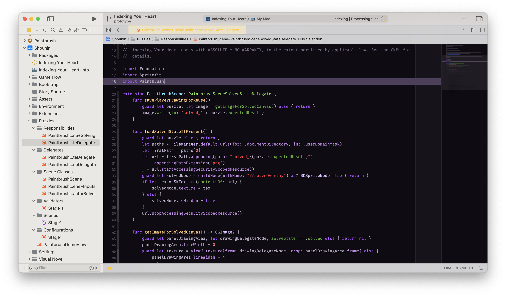
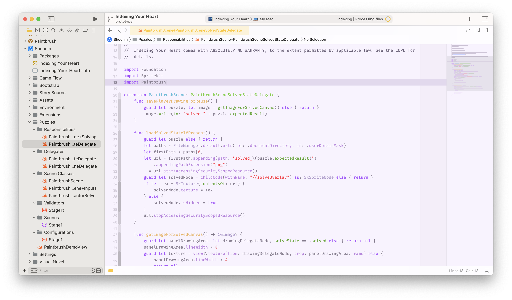
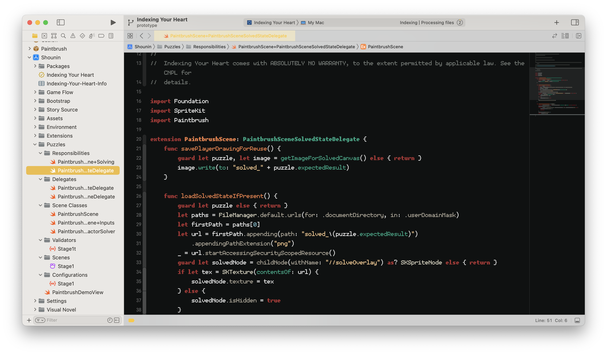
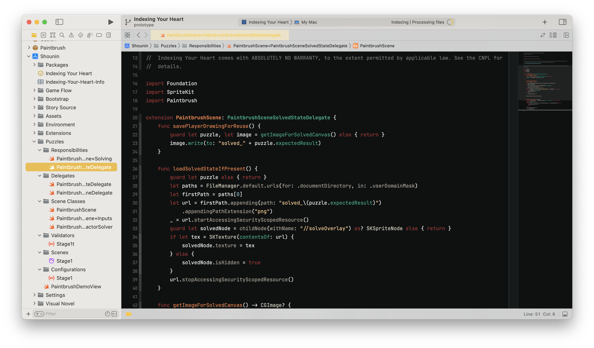

# Custom Xcode Color Themes

These are a variety of Xcode color themes I've created over the years. Feel free to use these to your liking.

## Installation

Just download any of the themes to your `~/Library/Developer/Xcode/UserData/FontAndColorThemes` directory.
They will appear in your themes list in Xcode when going to **Xcode > Settings...**.

## Themes List

### Roxanne (Light/Dark)
Race your way through that Jira ticket using this theme, heavily inspired by Roxy Raceway from FNAF: Security
Breach.

### Chelsea (Dark)
Develop your next big project in style with the Chelsea theme, which matches closely to the brand styleguide
for [Indexing Your Heart](https://indexingyourhe.art).

Two variants are included: one that uses the [Salmon 9 font family](https://phildjii.itch.io/salmon-family),
and one that uses JetBrains Mono.

